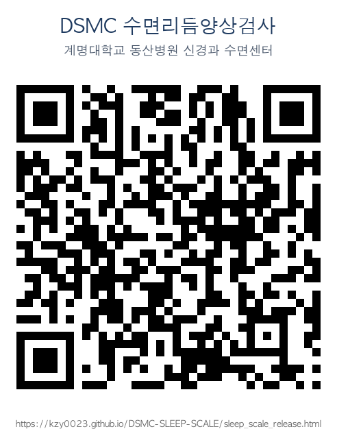

# DSMC Sleep Scale

수면리듬양상검사 웹 애플리케이션

## 사용법

`sleep_scale_release.html` 파일을 브라우저에서 열면 바로 사용 가능합니다.

**온라인 접속:** https://kzy0023.github.io/DSMC-SLEEP-SCALE/sleep_scale_release.html

## 포함된 검사 도구

### Scale I
- ISI (불면증 심각도 지수)
- STOP-Bang (수면무호흡 위험도)
- ESS (엡워스 졸음 척도)
- RLS (하지불안증후군 진단기준)

### Scale II
- PSQI-K (피츠버그 수면의 질 지수)
- DBAS-16 (역기능적 신념 및 태도)
- K-IRLS (국제하지불안척도) — RLS 4개 기준 충족 시에만 작성

## 기능

- 미응답 항목 검증
- 결과 자동 이메일 전송

## 버전

ver. 2026. AUG
